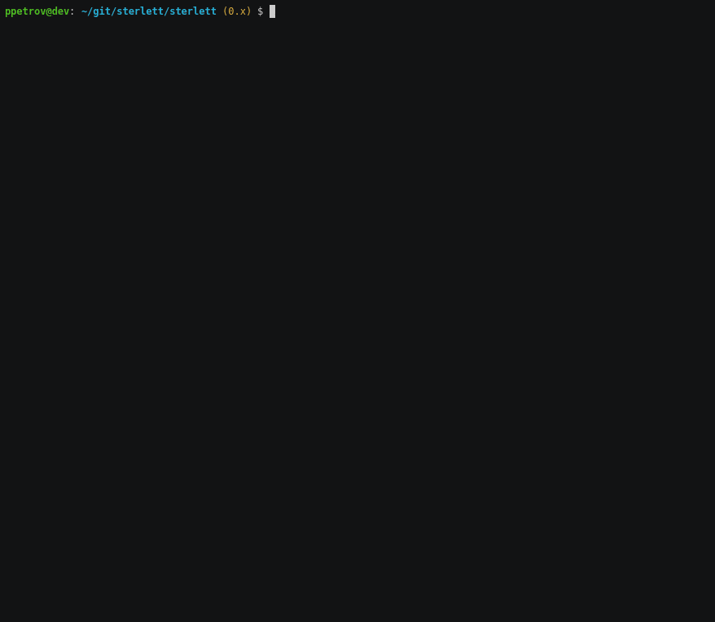

# Sterlett

<pre>
;C0tf;.
LGCGCLCf;.
itii;:itLLfffftLLffLL1;,
 ii:;;::;1tLCCL◖◗LfCCLLf1;,
  ii:;;:;:;;11fLLffLLfLCLff1,
   i;:::;:::ii111ttffffLCLftf1.
   ,..i;:::;1iiiiii1i1tfLfft1ft.
      ,;;;i11    ii1i111t1tf11fiii:.
      .,iftt111111tt111iii;tft1tttft:
   ,itLfi;i1tffftt111111111tGGCLt11tti.
.ifL1:,      .:1fLfffttttft1i1LCCCCfttti
tf;             .;1tfLLLLfft11it;;fLLLfLi
                     .,itLfffttt    ,itft
                     .i11tfft11tt,     ti.
</pre>

[](https://travis-ci.com/sterlett/sterlett)
[](https://www.codefactor.io/repository/github/sterlett/sterlett/overview/0.x)

- [Goals](#goals)
- [Architecture](#architecture)
- [Installation](#installation)
    - [Docker](#docker)
- [Console API](#console-api)
    - [Calculating V/B rating](#calculating-vb-rating)
    - [Downloading a benchmark list](#downloading-a-benchmark-list)
    - [Retrieving hardware prices](#retrieving-hardware-prices)
- [Honeycomb](#honeycomb)
    - [1.0 milestone](#10-milestone)
- [See also](#see-also)
- [Changelog](#changelog)

## Goals

**Sterlett** is a microservice and console API for retrieving and processing public information
about computer hardware prices. It may help to buy the most efficient microchips in your region
by the lowest available price, using several benchmark providers and taking into account local currency spikes
and pricing fraud.

## Architecture

The microservice represents a set of backend and frontend containers behind a gateway
for routing and load balancing ([stack](https://github.com/itnelo/reactphp-foundation#docker-swarm)).

Backend: PHP 7.4+, [ReactPHP](https://github.com/reactphp/reactphp), 
[Symfony](https://github.com/symfony/symfony) 5 components (async adapters).
[MySQL](https://dev.mysql.com/doc/refman/8.0/en) 8 for data persistence. \
Frontend: JavaScript (ES5, ES6+), [Svelte](https://github.com/sveltejs/svelte) 3,
[Spectre.css](https://github.com/picturepan2/spectre). [Lighttpd](https://lighttpd.net) 1.4 to serve assets. \
Gateway: [HAProxy](https://www.haproxy.com) 2.2.

## Installation

### Docker

> Ensure you have a [Docker daemon](https://docs.docker.com/get-docker) and a [compose](https://docs.docker.com/compose)
> tool available on your machine.

Clone the repository, then build a `.env` and other configuration files:

```
$ git clone git@github.com:sterlett/sterlett.git sterlett && cd "$_"
$ bin/configure-env dev
$ cp config/parameters.yml.dev.dist config/parameters.yml
```

The microservice scope requires an HTTP/HTTPS proxy for some websites, specify a valid host and port in the `.env` file
you have just created:

```
$ sed -i -E "s/(SELENIUM_PROXY_HOST)=_/\1=0.0.0.0/" .env      # replace 0.0.0.0
$ sed -i -E "s/(SELENIUM_PROXY_PORT)=_/\1=80/" .env           # replace 80
```

Build images:

```
$ docker-compose build --no-cache --force-rm --parallel
```

In the `dev` environment you need to manually install back/front dependencies for the project (however, there are also
`Dockerfile-standalone` files, which you can use to build isolated and self-sufficient containers):

```
$ docker-compose run --rm --no-deps app composer install
$ docker-compose run --rm --no-deps app npm clean-install --no-optional
```

Apply migrations (note: you may need to wait for a few minutes during the first-time database initialization, before
you can actually execute this command):

```
$ docker-compose run --rm app bin/console migrations:migrate --no-interaction -vv latest
```

To compile frontend assets:

```
$ docker-compose run --rm --no-deps app npm run dev
```

Now you can launch a microservice at [http://localhost:6638](http://localhost:6638/stats) (or interact with
command-line interface, see below):

```
$ docker-compose up -d
```

## Console API

### Calculating V/B rating

Value/Benchmark (or _Price/Benchmark_) ratio — is a numerical score, that will be assigned for the hardware item to
measure its customer appeal. The more V/B ratio it has, the bigger benefit you can get from buying this item in
terms of rough price/performance. You can calculate a V/B rating for the available hardware items manually, with the
following command:

```
$ docker-compose run --rm --no-deps app bin/console ratio:calculate
```

Example:


The source data includes both hardware benchmarks and price lists from the third-party web resources. It is possible to
dump contents of related providers by the other API methods.

### Downloading a benchmark list

Renders a list with benchmark results from the configured providers, which are used in the algorithm as a source
for hardware efficiency measure.

```
$ docker-compose run --rm --no-deps app bin/console benchmark:list
```

Example:


You can specify a minimum benchmark score for items to be shown in the table using `passmark.cpu.min_value` in 
`parameters.yml`.

### Retrieving hardware prices

Renders a table with hardware prices from the different sellers, which are used to suggest deals *.

> \* — Actually, a [FallbackProvider](src/back/Hardware/Price/Provider/HardPrice/FallbackProvider.php) will be used for
> price retrieving in the console environment; a normal run could take from 20 minutes to 2.5+ hours, due to some
> sophisticated scraping techs that are executing asynchronously, in the background, and guarantee a certain level of
> stability, while the microservice serves HTTP requests. See [BrowsingProvider](src/back/Hardware/Price/Provider/HardPrice/BrowsingProvider.php).

Currently supported regions: RU/CIS.

```
$ docker-compose run --rm --no-deps app bin/console price:list
```

Example:



## Honeycomb

This one is currently at the development stage :honeybee:.

:honey_pot: Backend base \
:honey_pot: Frontend base \
:honey_pot: Routing and load balancing capabilities \
:honey_pot: CI ground \
:honey_pot: Prices retrieving \
:honey_pot: Benchmarks retrieving \
:honey_pot: Data persistence \
:honey_pot: Console API: CPU list \
:honey_pot: Microservice: CPU list \
:honey_pot: Microservice: CPU deals

### 1.0 milestone

:black_square_button: Microservice: GPU list \
:black_square_button: Microservice: GPU deals \
:black_square_button: 1 year of stable work in production

## See also

- [itnelo/reactphp-foundation](https://github.com/itnelo/reactphp-foundation) — A fresh skeleton
for building asynchronous microservices using PHP 7.4+, ReactPHP and Symfony 5 components,
with a deployment preset for scaling and load balancing.
- [itnelo/reactphp-webdriver](https://github.com/itnelo/reactphp-webdriver) — **Sterlett** uses the ReactPHP WebDriver,
a fast and non-blocking PHP client for [Selenium](https://www.selenium.dev) browser automation engine,
to acquire data from some websites.

## Changelog

All notable changes to this project will be documented in [CHANGELOG.md](CHANGELOG.md).